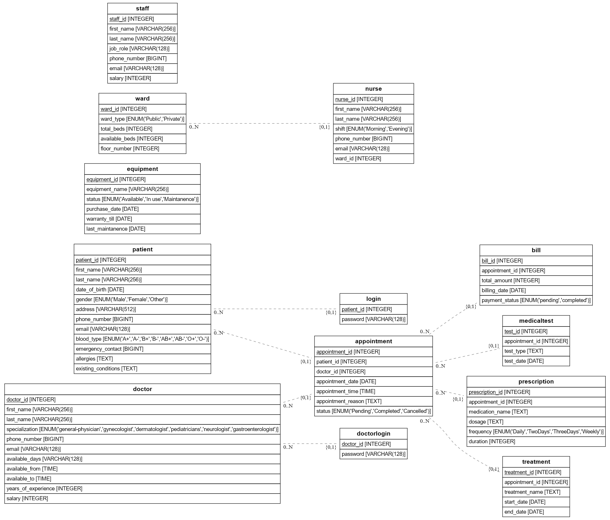
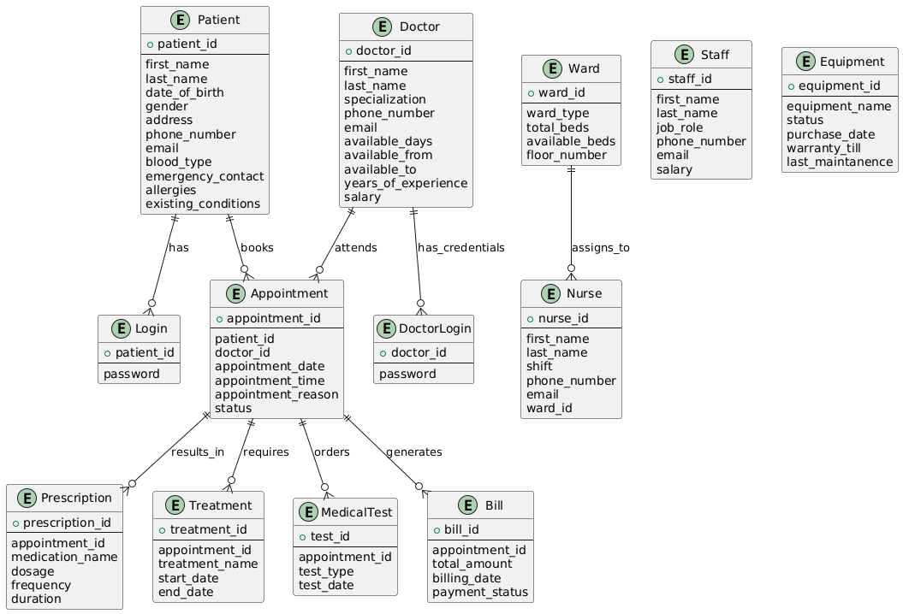
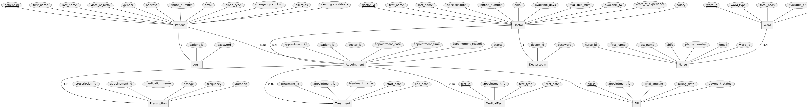

# Hospital Management System

This project is a comprehensive full-stack Hospital Management System that efficiently manages patient records, appointments, doctors, nurses, prescriptions, treatments, billing, and more. It features a well-structured database schema, a React.js-based frontend, and an Express.js backend to ensure seamless user interaction and data handling.

## Features

- **Patient Management:** Record personal details, medical history, and appointment data.
- **Doctor & Nurse Management:** Track doctor specializations, availability, and nurses assigned to wards.
- **Appointments & Billing:** Schedule appointments and generate bills with ease.
- **Treatment & Prescription Tracking:** Manage treatments, prescriptions, and medical tests associated with appointments.

## ER Diagrams

### Patient and Appointment Management ER Diagram


### Doctor and Nurse Management ER Diagram


### Billing and Medical Records Management ER Diagram


## Project Structure

The project is organized into three main folders:

- **Backend:** Contains the Express.js server code for managing API endpoints and database interactions.
- **Frontend:** Contains the React.js code for the user interface, providing an interactive web application.
- **Database Files:** Contains SQL scripts and a Jupyter notebook for creating the database schema and inserting sample data.

## Prerequisites

Before running the project, ensure you have the following installed:

- **MySQL**: Database management system for data storage.
- **MySQL Workbench**: A GUI tool to manage and interact with MySQL databases.
- **MySQL Python Connector**: Required for executing database scripts through Python.

## Getting Started

### Step 1: Database Setup

1. Open the **database_files** folder.
2. Run the `create_database.ipynb` and `insert_database.ipynb` files in Jupyter Notebook to create the database schema and insert sample data into the MySQL database.

### Step 2: Backend Setup

1. Open a terminal and navigate to the **backend** folder:

   ```bash
   cd backend
   ```

2. Start the backend server:

   ```bash
   npm start
   ```

   The backend server should now be running.

### Step 3: Frontend Setup

1. Open a **new terminal** window.
2. Navigate to the **frontend** folder:

   ```bash
   cd frontend
   ```

3. Start the React.js frontend development server:

   ```bash
   npm run dev
   ```

   The frontend should now be running on the specified development URL.

### Step 4: Running the Website

- Once both the backend and frontend are up and running, open your browser and navigate to the provided local development URL (shown in the terminal) to interact with the Hospital Management System.
